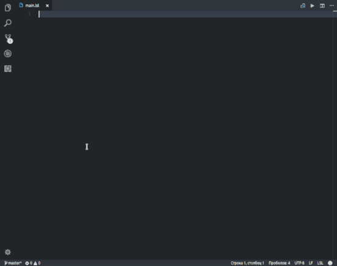
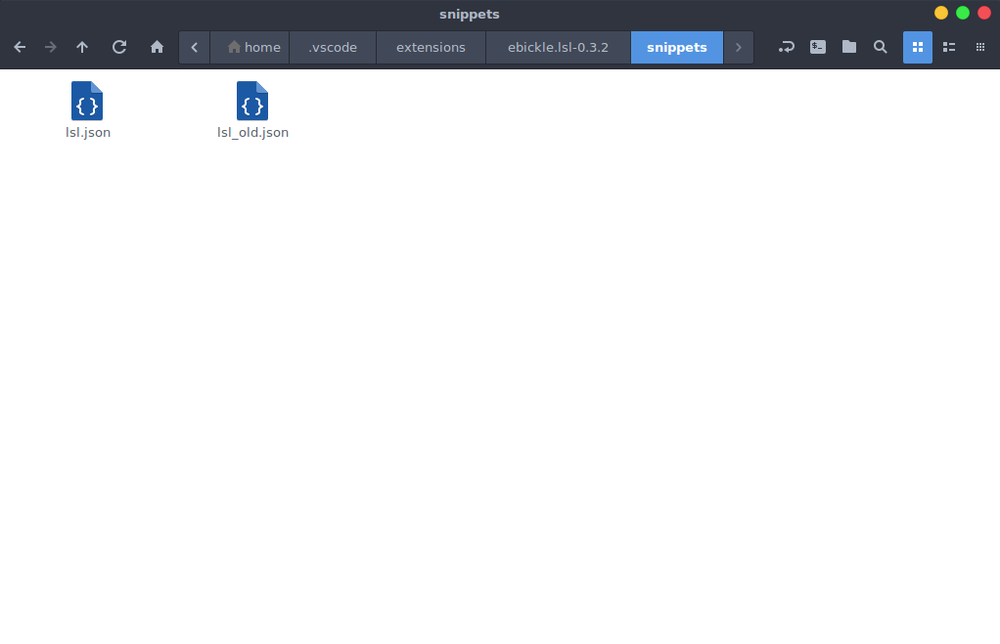

# LSL Snippets for Visual Studio Code #
*   **Functions** 
*   **Events** 
*   **Types** 
*   **Constants** 

***[Video  preview](https://youtu.be/xRJ3NJQXoiI)***
#### [Visual Studio Code](https://code.visualstudio.com/ "Visual Studio Code") как альтернативный редактор [LSL (Linden Scripting Language)](http://wiki.secondlife.com/wiki/LSL_Portal "LSL Portal") ####

> 1.   Установить [Visual Studio Code](https://code.visualstudio.com/ "Visual Studio Code")
>>
> 2.   Установить расширение 'LSL (Eric Bickle)' [Marketplace](https://marketplace.visualstudio.com/items?itemName=ebickle.lsl "Marketplace") или [Git repository](https://github.com/ebickle/lsl-vscode "Git repository")
>>
>3. Заменить стандартный lsl.json в папке плагина
>>
>     Windows %USERPROFILE%\.vscode\extensions
>     Mac ~/.vscode/extensions
>     Linux ~/.vscode/extensions
>
>**пример**: _lsl_min.json >> lsl.json >> ~/.vscode/extensions/ebickle.lsl-0.3.2/snippets/lsl.json_
>
>       lsl_min_ru.json - Описание функций переведено Яндекс переводом

***
> 1.   To Install [Visual Studio Code](https://code.visualstudio.com/ "Visual Studio Code")
>>
> 2.   To install the extension 'LSL (Eric Bickle)' [Marketplace](https://marketplace.visualstudio.com/items?itemName=ebickle.lsl "Marketplace") or [Git repository](https://github.com/ebickle/lsl-vscode "Git repository")
>>
>3. To replace the standard lsl.json in the plugin folder
>>
>     Windows %USERPROFILE%\.vscode\extensions
>     Mac ~/.vscode/extensions
>     Linux ~/.vscode/extensions
>
>**example**: _lsl_min.json >> lsl.json >> ~/.vscode/extensions/ebickle.lsl-0.3.2/snippets/lsl.json_

